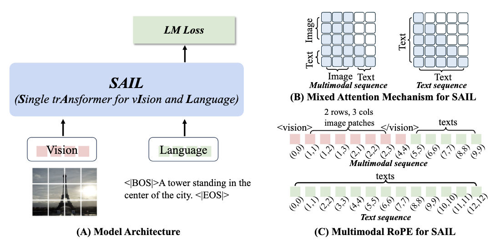
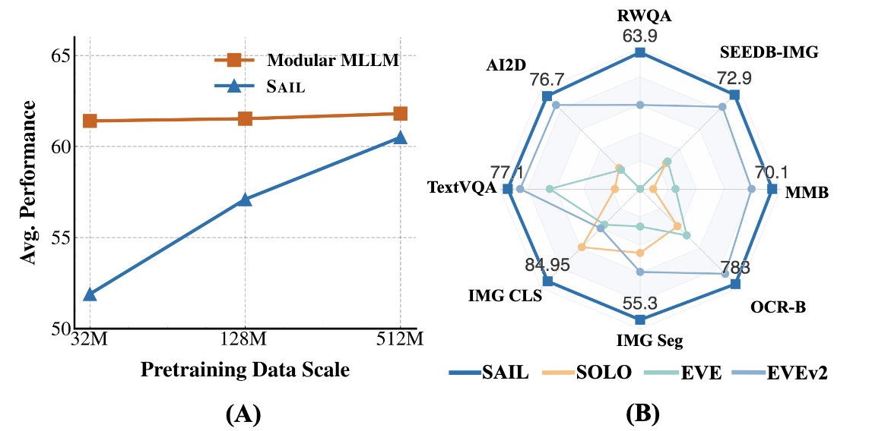

<div align="center">
 👋 Hi, everyone! 
    <br>
    We are <b>ByteDance Seed team.</b>
</div>

<p align="center">
  You can get to know us better through the following channels👇
  <br>
  <a href="https://team.doubao.com/">
    </a>
  <a href="https://github.com/user-attachments/assets/93481cda-a7f3-47f3-b333-fe6b3da86b78">
    </a>
 <a href="https://www.xiaohongshu.com/user/profile/668e7e15000000000303157d?xsec_token=ABl2-aqekpytY6A8TuxjrwnZskU-6BsMRE_ufQQaSAvjc%3D&xsec_source=pc_search">
    </a>
  <a href="https://www.zhihu.com/org/dou-bao-da-mo-xing-tuan-dui/">
    </a>
</p>


# The Scalability of Simplicity: Empirical Analysis of Vision-Language Learning with a Single Transformer (SAIL)
<p align="center">
  <a href="https://github.com/bytedance/flux">
    </a>
  <a href="https://arxiv.org/abs/2504.10462">
    </a>
  <a href="XXXX">
    </a>
  <a href="LICENSE">
    </a>
</p>

We are extremely delighted to release SAIL, a **S**ingle tr**A**nsformer model for v**I**sion and **L**anguage. SAIL is a unified multimodal large language model (MLLM) that seamlessly integrates raw pixel encoding and language decoding within a single architecture. **​Without relying on pre-trained vision encoders**, SAIL achieves competitive performance across a wide range of vision-language tasks and demonstrates strong visual representation, rivaling state-of-the-art vision models in tasks like semantic segmentation.

## Model & Micro Design
<div align="center">
  
</div>

## An Overview of Comparison
(A) Data scaling curve for Modular Multimodal Large Language Model (MLLM) and SAIL, our Single Transformer-based MLLM. As pretraining data increases, SAIL shows a sharper performance gain, demonstrating  its superior data scalability.
(B) Comparison to existing Single Transformer-based MLLMs, our SAIL pushes the performance boundaries on both vision tasks and vision-language tasks.
<div align="center">
  
</div>

# News
[2025/04/02]🔥We release SAIL models and technical report.


# Getting started
### Prepraration
```bash
pip3 install torch==2.5.1 torchvision==0.20.1 torchaudio==2.5.1
pip3 install einops transformers==4.42.0
```

### Example
Firstly, clone the SAIL repo,
```bash
git clone https://github.com/bytedance/SAIL
cd SAIL
```

and then, simpley run `example.py`
```bash
python3 example.py
```

or refer to the following code block:
```python
from example import *

NON_VISION_TOKEN_ID = -1
PATH_TO_MODEL = "path to model"
PATH_TO_TOKENIZER = "path to tokenizer"
IMAGE_PATH = "path to image"
PROMPT = "content of prompt"

model, tokenizer = get_transformer_and_tokenizer(
    PATH_TO_MODEL,
    PATH_TO_TOKENIZER
)
model = model.cuda()

image_processor = lambda x: convert_image_base64_to_patches(load_image_to_base64(x), model.config.vision_patch_size, fix_res_size=None)
prompt_inp = tokenizer.bos_token + '[INST] {} [/INST]'.format(PROMPT)
image_path = IMAGE_PATH   
image_patches = image_processor(image_path)
nh, nw = image_patches.shape[:2]
image_tokens, image_tokens_len = prepare_image_textual_seq_norowsep(nh, nw, tokenizer, add_cls=False)

input_tokens = image_tokens + prompt_inp
input_ids = tokenizer(input_tokens, add_special_tokens=False, return_tensors="pt").input_ids
vision_patch_indices = torch.full_like(input_ids, fill_value=NON_VISION_TOKEN_ID)
vision_patches = image_patches.view(nh * nw, -1)
assert (input_ids == tokenizer.vis_patch_tok_id).sum() == vision_patches.size(0)
assert (input_ids >= tokenizer.vis_beg_tok_id).sum() == image_tokens_len

vision_patch_indices[input_ids==tokenizer.vis_patch_tok_id] = torch.arange(vision_patches.size(0))
attention_mask = create_single_prefix_mask(image_tokens_len, input_ids.size(-1)).unsqueeze(0).unsqueeze(0)
position_ids = generate_mm_pos_ids_singleit(input_ids.squeeze(0).numpy().tolist(), tokenizer.vis_patch_tok_id, nh, nw).unsqueeze(1)

input_ids = input_ids.long().cuda()
vision_patch_indices = vision_patch_indices.long().cuda()
vision_patches = vision_patches.to(torch.bfloat16).cuda()
position_ids = position_ids.long().cuda()
attention_mask = attention_mask.cuda()

padding_attention_mask = torch.ones_like(input_ids).cuda()

inputs = dict(
    input_ids = input_ids,
    position_ids = position_ids,
    attention_mask = padding_attention_mask,
    vision_patches = vision_patches,
    vision_patch_indices = vision_patch_indices,
    use_cache=True
)

cached_inputs = dict(
    input_ids = input_ids[:, :image_tokens_len],
    position_ids = position_ids[:, :, :image_tokens_len],
    attention_mask = attention_mask[:,:, :image_tokens_len, :image_tokens_len],
    vision_patches = vision_patches,
    vision_patch_indices = vision_patch_indices[:, :image_tokens_len],
    use_cache=True
)

prefix_cache = DynamicCache()
with torch.no_grad():
    prefix_cache = model.forward(**cached_inputs, past_key_values=prefix_cache).past_key_values

past_key_values = copy.deepcopy(prefix_cache)
generate_config = GenerationConfig(
    max_new_tokens=1024,
    return_dict_in_generate=True,
    output_attentions=False
)
generated = model.generate(
    **inputs,
    past_key_values=past_key_values,
    generation_config=generate_config
)
generated_ids = generated['sequences'][:, input_ids.size(1):]
response = tokenizer.batch_decode(
    generated_ids, skip_special_tokens=True, clean_up_tokenization_spaces=False
)[0]

print(f"\nModel Response: ===\n{response}\n===")
```

# Features
- SAIL as an MLLM, check our model at [huggingface](https://huggingface.co/models/xxx/SAIL-7B-SFT).
- SAIL as a Vision Encoder, check our model at [huggingface](https://huggingface.co/models/xxx/SAIL-7B-PT).
- Explore [Pixel SAIL](https://github.com/bytedance/Pixel-SAIL), using SAIL For Pixel-Grounded Understanding.


# Acknowledgement
Part of our codes are built up on [SOLO](https://github.com/Yangyi-Chen/SOLO/tree/main).
We thank the authors for their impressive contribution.

# License
This project is licensed under Apache2.0. See the [LICENSE](LICENSE). flie for details.

# Citation
If you find SAIL useful for your research and applications, feel free to give us a star ⭐ or cite us using:

```bibtex
@article{lei2025sail,
  title={The Scalability of Simplicity: Empirical Analysis of Vision-Language Learning with a Single Transformer},
  author={Lei, Weixian and Wang, Jiacong and Wang, Haochen and Li, Xiangtai and Liew, Jun Hao and Feng, Jiashi and Huang, Zilong},
  journal={arXiv preprint arXiv:2504.10462},
  year={2025}
}
```

# About [ByteDance Seed Team](https://team.doubao.com/)

Founded in 2023, ByteDance Seed Team is dedicated to crafting the industry's most advanced AI foundation models. The team aspires to become a world-class research team and make significant contributions to the advancement of science and society.
